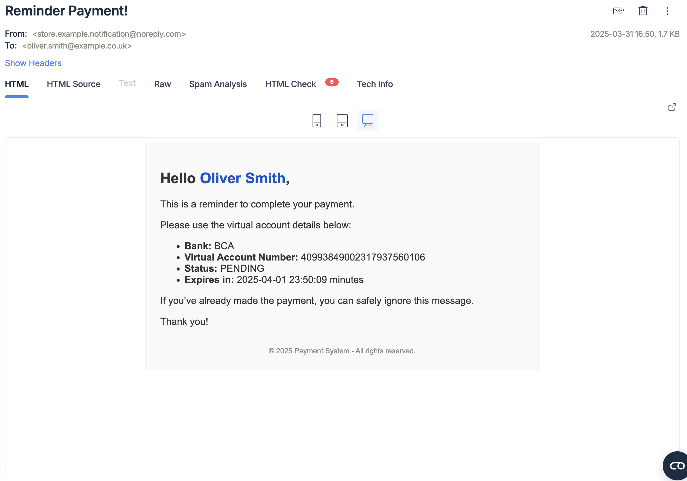
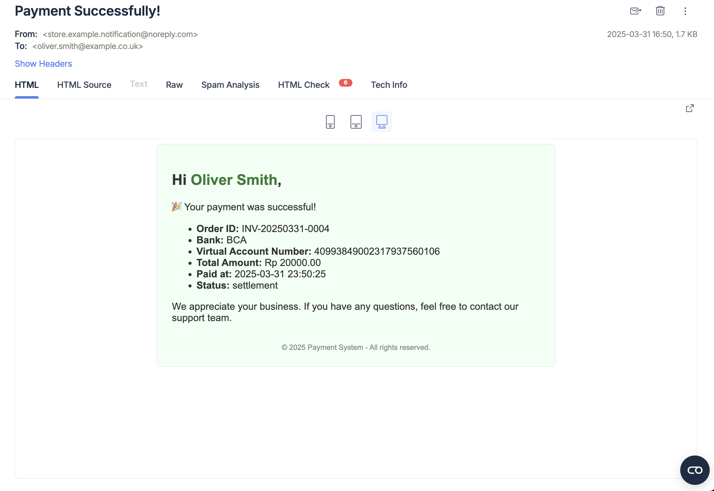

# Payment Gateway Integration – Midtrans

This project implements a Virtual Account (VA) Bank Transfer flow using Midtrans API. Below are examples of email templates used for reminders and payment confirmations.

---

## 📧 Remainder Email

This email is sent to the customer when their payment is still pending or approaching due time. It includes payment details and clear instructions for completing the transaction.

---

## ✅ Payment Success Email

This email is sent to the customer once the payment has been successfully completed. It includes a summary of the transaction and confirmation that the order has been processed.

---

## 🧪 Testing in Sandbox

You can simulate and test VA payments using Midtrans's sandbox environment:

👉 **[Midtrans Sandbox VA Testing Guide](https://doc-midtrans.dev.fleava.com/en/technical-reference/sandbox-test?id=bank-transfer)**

Use this to test payment scenarios for BCA, BNI, Mandiri, and other supported banks.

---

## 📚 Midtrans API Reference

Refer to the official Midtrans documentation for full API capabilities, request/response formats, and integration guidelines:

👉 **[Midtrans Core API Overview](https://docs.midtrans.com/reference/core-api-overview)**

---

## 📌 Notes

- Ensure the `docs/` folder exists at the root level of your project.
- Keep image file names consistent if you update the images.
- Markdown image paths are **relative**, so GitHub or Markdown viewers will load them correctly.

---

Feel free to customize email styles in `templates/email/` to match your brand.