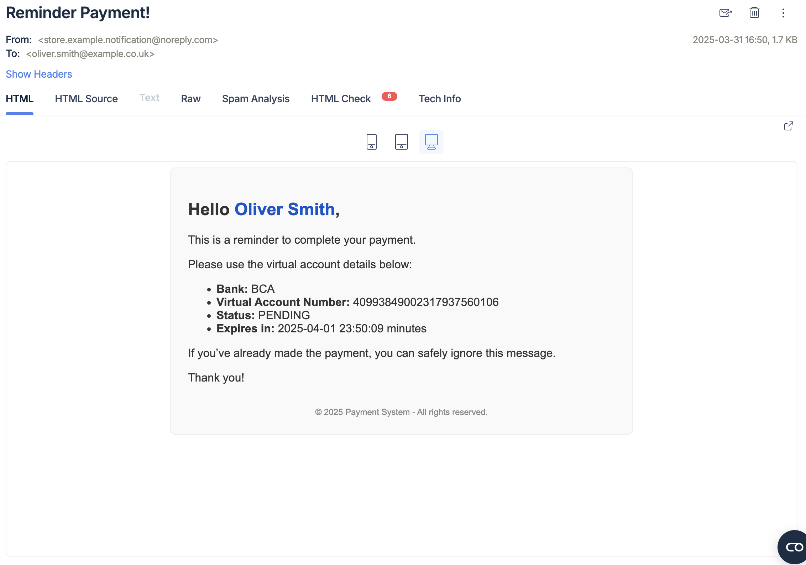
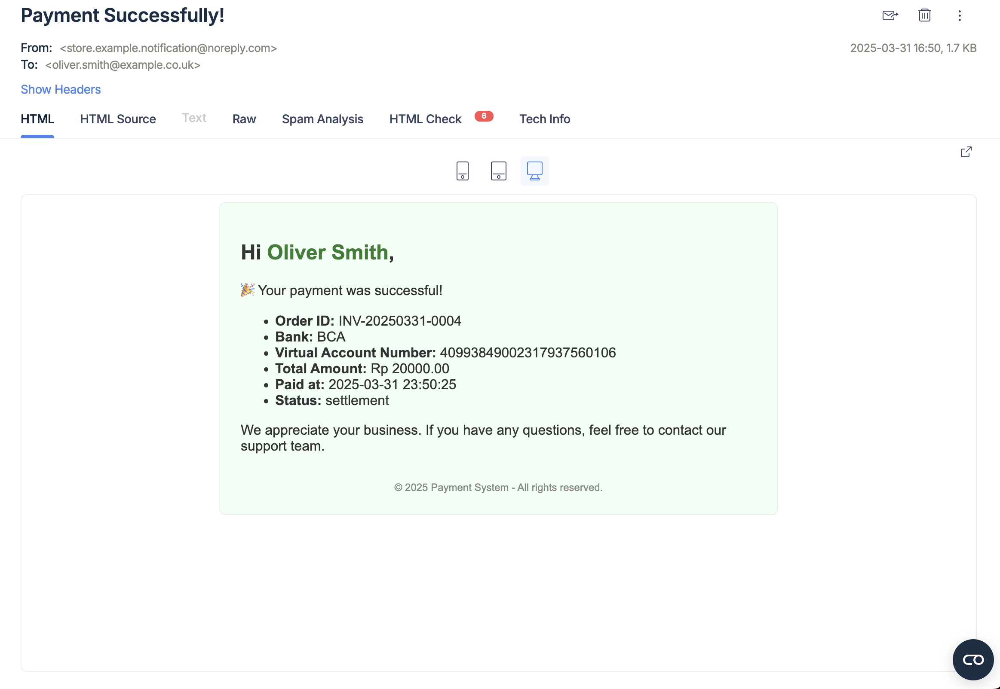
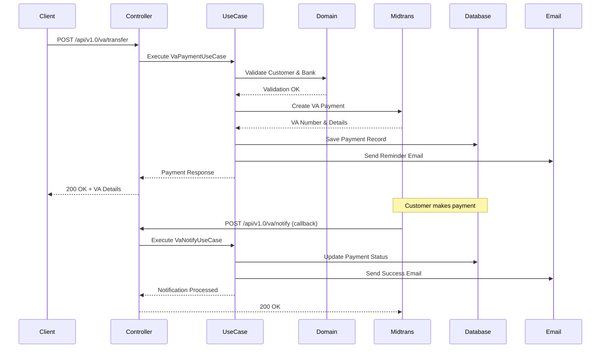

# Payment Gateway Integration – Midtrans

A robust Virtual Account (VA) payment gateway integration service built with **Hexagonal Architecture**, enabling seamless bank transfer flows through Midtrans API.

[](https://www.oracle.com/java/)
[](https://spring.io/projects/spring-boot)
[](https://midtrans.com/)

---

## 📋 Table of Contents

- [Features](#-features)
- [Architecture Overview](#-architecture-overview)
- [Project Structure](#-project-structure)
- [Tech Stack](#-tech-stack)
- [Getting Started](#-getting-started)
- [Email Notifications](#-email-notifications)
- [Testing](#-testing-in-sandbox)
- [API Documentation](#-api-documentation)
- [Configuration](#-configuration)
- [License](#-license)

---

## ✨ Features

- 🏦 **Multi-Bank Virtual Account Support** (BCA, BNI, Mandiri, Permata, etc.)
- 📧 **Automated Email Notifications** (payment reminders & confirmations)
- 🔔 **Real-time Payment Callbacks** from Midtrans
- 🔐 **Secure Payment Processing** with transaction validation
- 📊 **Payment History Tracking** with comprehensive logging
- 🧩 **Clean Architecture** with clear separation of concerns
- 🧪 **Sandbox Testing Support** for safe development

---

## 🧱 Architecture Overview

This application implements **Hexagonal Architecture (Ports & Adapters)**, ensuring maintainability, testability, and framework independence.

```
┌─────────────────────────────────────────────────────────┐
│                    INBOUND ADAPTERS                      │
│         (REST Controllers, Messaging Handlers)           │
└────────────────────┬────────────────────────────────────┘
                     │
┌────────────────────▼────────────────────────────────────┐
│                  APPLICATION LAYER                       │
│              (Use Cases & Orchestration)                 │
└────────────────────┬────────────────────────────────────┘
                     │
┌────────────────────▼────────────────────────────────────┐
│                    DOMAIN LAYER                          │
│         (Business Logic, Entities, Ports)                │
└────────────────────┬────────────────────────────────────┘
                     │
┌────────────────────▼────────────────────────────────────┐
│                   OUTBOUND ADAPTERS                      │
│      (Database, External APIs, Email Service)            │
└─────────────────────────────────────────────────────────┘
```

### Layer Responsibilities

**Domain Layer** - Core business logic and rules
- Business entities (Payment, Customer, Bank, etc.)
- Domain services with business operations
- Port definitions (interfaces) for external dependencies
- Framework and infrastructure independent

**Application Layer** - Use case orchestration
- Coordinates domain services and external ports
- Defines transaction boundaries
- Executes business workflows
- Input validation and error handling

**Infrastructure Layer** - Technical implementation
- **Inbound**: REST controllers, messaging consumers
- **Outbound**: Database adapters (JPA), external API clients (Midtrans, Email)
- Configuration management
- Framework-specific implementations

**Shared Layer** - Cross-cutting concerns
- Custom annotations and AOP aspects
- Common utilities (JSON, Base64, Time, Validation)
- Exception handling and error responses
- Enums and constants

---

## 📂 Project Structure

```
app-midtrans/
├── 📱 application/              # Use cases and orchestration
│   ├── UseCaseExecutor.java
│   └── usecase/
│       ├── VaNotifyUseCase.java
│       └── VaPaymentUseCase.java
│
├── 🧠 domain/                   # Core business logic
│   ├── bank/
│   ├── bankAccount/
│   ├── callback/
│   ├── customer/
│   ├── email/
│   └── payment/
│
├── 🔌 infra/                    # Infrastructure & adapters
│   ├── adapter/
│   │   ├── inbound/            # REST & Messaging
│   │   └── outbound/           # DB, APIs, Email
│   └── config/                 # Spring configurations
│
└── 🛠️ shared/                   # Common utilities
    ├── annotation/
    ├── aop/
    ├── enums/
    ├── exception/
    ├── handler/
    ├── payload/
    └── utils/
```

[View detailed structure →](PROJECT_STRUCTURE.md)

---

## 🚀 Tech Stack

### Core Technologies
- **Java 17+** - Programming language
- **Spring Boot 3.x** - Application framework
- **Spring Data JPA** - Data persistence
- **Hibernate** - ORM framework
- **PostgreSQL/MySQL** - Database (configurable)

### External Integrations
- **Midtrans API** - Payment gateway
- **Mailtrap** - Email service (development)
- **SMTP** - Email delivery (production)

### Development Tools
- **Maven** - Dependency management
- **Lombok** - Code generation
- **SpringDoc OpenAPI** - API documentation
- **SLF4J + Logback** - Logging

---

## 🎯 Getting Started

### Prerequisites

- Java 17 or higher
- Maven 3.6+
- PostgreSQL/MySQL database
- Midtrans account (sandbox for testing)
- Email service credentials

### Installation

1. **Clone the repository**
   ```bash
   git clone https://github.com/yourusername/app-midtrans.git
   cd app-midtrans
   ```

2. **Configure application properties**
   ```bash
   cp src/main/resources/application.properties.example src/main/resources/application.properties
   ```

3. **Set up environment variables**
   ```bash
   export MIDTRANS_SERVER_KEY=your_server_key
   export MIDTRANS_CLIENT_KEY=your_client_key
   export DATABASE_URL=jdbc:postgresql://localhost:5432/midtrans_db
   export EMAIL_HOST=sandbox.smtp.mailtrap.io
   export EMAIL_USERNAME=your_username
   export EMAIL_PASSWORD=your_password
   ```

4. **Build the project**
   ```bash
   mvn clean install
   ```

5. **Run the application**
   ```bash
   mvn spring-boot:run
   ```

The application will start on `http://localhost:8080`

### Database Setup

Run the following SQL to create the database:

```sql
CREATE DATABASE midtrans_db;
```

Tables will be auto-created by Hibernate on first run (if `spring.jpa.hibernate.ddl-auto=update`).

---

## 📧 Email Notifications

The system sends automated email notifications at key points in the payment lifecycle.

### Payment Reminder Email

Sent when payment is pending or approaching due time, containing payment instructions and virtual account details.



### Payment Success Email

Sent immediately after successful payment confirmation, including transaction summary and order details.



### Email Configuration

Customize email templates in `src/main/resources/templates/email/`:
- `reminder-email.html` - Payment reminder template
- `success-email.html` - Payment confirmation template

Templates support dynamic variables like `${customerName}`, `${amount}`, `${vaNumber}`, etc.

---

## 🧪 Testing in Sandbox

Midtrans provides a comprehensive sandbox environment for testing all payment scenarios without real money.

### How to Test VA Payments

1. Create a payment request via API
2. Use the test VA number provided by Midtrans
3. Simulate payment using Midtrans Simulator

### Test Virtual Account Numbers

| Bank    | VA Number Format      | Example           |
|---------|-----------------------|-------------------|
| BCA     | 5XXXX + order_id      | 500012345678      |
| BNI     | 8XXXX + order_id      | 800012345678      |
| Mandiri | 7XXXX + order_id      | 700012345678      |
| Permata | 10-digit number       | 8562000001234567  |

### Testing Resources

- 📖 [Midtrans Sandbox Testing Guide](https://docs.midtrans.com/docs/testing-payment-on-sandbox)
- 🏦 [Bank Transfer Test Scenarios](https://docs.midtrans.com/docs/bank-transfer-testing)
- 💳 [Virtual Account Simulator](https://simulator.sandbox.midtrans.com/)

---

## 📚 API Documentation

### Interactive API Docs

Once the application is running, access the interactive API documentation:

- **Swagger UI**: `http://localhost:8080/swagger-ui.html`
- **OpenAPI JSON**: `http://localhost:8080/v3/api-docs`

### Key Endpoints

#### Create Virtual Account Payment
```http
POST /api/v1.0/va/transfer
Content-Type: application/json

{
  "customerId": "12345",
  "bankCode": "bca",
  "amount": 100000,
  "orderId": "ORDER-2024-001",
  "itemDetails": [...]
}
```

#### Payment Notification Callback
```http
POST /api/v1.0/va/notify
Content-Type: application/json

{
  "transaction_id": "...",
  "order_id": "...",
  "transaction_status": "settlement",
  ...
}
```

### Midtrans API Reference

For complete API capabilities and integration guidelines:
- 📘 [Core API Overview](https://docs.midtrans.com/reference/core-api-overview)
- 🔐 [Authentication](https://docs.midtrans.com/docs/api-authorization-and-headers)
- 🏦 [Bank Transfer API](https://docs.midtrans.com/docs/bank-transfer)

---

## ⚙️ Configuration

### Application Properties

Key configuration properties:

```properties
# Server
server.port=8080

# Database
spring.datasource.url=${DATABASE_URL}
spring.datasource.username=${DB_USERNAME}
spring.datasource.password=${DB_PASSWORD}
spring.jpa.hibernate.ddl-auto=update

# Midtrans
midtrans.server.key=${MIDTRANS_SERVER_KEY}
midtrans.client.key=${MIDTRANS_CLIENT_KEY}
midtrans.is.production=false
midtrans.api.url=https://api.sandbox.midtrans.com/v2

# Email
spring.mail.host=${EMAIL_HOST}
spring.mail.port=587
spring.mail.username=${EMAIL_USERNAME}
spring.mail.password=${EMAIL_PASSWORD}
spring.mail.properties.mail.smtp.auth=true
spring.mail.properties.mail.smtp.starttls.enable=true
```

### Environment Variables

| Variable              | Description                    | Required |
|-----------------------|--------------------------------|----------|
| `MIDTRANS_SERVER_KEY` | Midtrans server key            | Yes      |
| `MIDTRANS_CLIENT_KEY` | Midtrans client key            | Yes      |
| `DATABASE_URL`        | Database connection URL        | Yes      |
| `DB_USERNAME`         | Database username              | Yes      |
| `DB_PASSWORD`         | Database password              | Yes      |
| `EMAIL_HOST`          | SMTP host                      | Yes      |
| `EMAIL_USERNAME`      | SMTP username                  | Yes      |
| `EMAIL_PASSWORD`      | SMTP password                  | Yes      |

---

## 🔄 Payment Flow Example


```mermaid
sequenceDiagram
    participant Client
    participant Controller
    participant UseCase
    participant Domain
    participant Midtrans
    participant Database
    participant Email

    Client->>Controller: POST /api/v1.0/va/transfer
    Controller->>UseCase: Execute VaPaymentUseCase
    UseCase->>Domain: Validate Customer & Bank
    Domain-->>UseCase: Validation OK
    UseCase->>Midtrans: Create VA Payment
    Midtrans-->>UseCase: VA Number & Details
    UseCase->>Database: Save Payment Record
    UseCase->>Email: Send Reminder Email
    UseCase-->>Controller: Payment Response
    Controller-->>Client: 200 OK + VA Details
    
    Note over Midtrans,Database: Customer makes payment
    
    Midtrans->>Controller: POST /api/v1.0/va/notify (callback)
    Controller->>UseCase: Execute VaNotifyUseCase
    UseCase->>Database: Update Payment Status
    UseCase->>Email: Send Success Email
    UseCase-->>Controller: Notification Processed
    Controller-->>Midtrans: 200 OK
```

---

## 🧪 Testing

### Unit Tests

```bash
mvn test
```

### Integration Tests

```bash
mvn verify
```

### Test Coverage

```bash
mvn clean test jacoco:report
```

View coverage report at `target/site/jacoco/index.html`

---

## 📝 Contributing

Contributions are welcome! Please follow these steps:

1. Fork the repository
2. Create a feature branch (`git checkout -b feature/amazing-feature`)
3. Commit your changes (`git commit -m 'Add amazing feature'`)
4. Push to the branch (`git push origin feature/amazing-feature`)
5. Open a Pull Request

---

## 🐛 Known Issues & Roadmap

### Current Limitations
- Email service limited to Mailtrap in development
- Single currency support (IDR only)
- No retry mechanism for failed callbacks

### Planned Features
- [ ] Multi-currency support
- [ ] Payment retry mechanism
- [ ] Webhook signature verification
- [ ] Admin dashboard
- [ ] Payment analytics
- [ ] Refund support

---

## 📄 License

This project is licensed under the MIT License - see the [LICENSE](LICENSE) file for details.

---

## 🤝 Support

For questions or issues:
- 📧 Email: support@yourdomain.com
- 🐛 Issues: [GitHub Issues](https://github.com/yourusername/app-midtrans/issues)
- 📖 Docs: [Wiki](https://github.com/yourusername/app-midtrans/wiki)

---

## 🙏 Acknowledgments

- [Midtrans](https://midtrans.com/) for the payment gateway platform
- [Spring Framework](https://spring.io/) for the excellent ecosystem
- The clean architecture community for architectural patterns

---

**Made with ❤️ by Your Team**